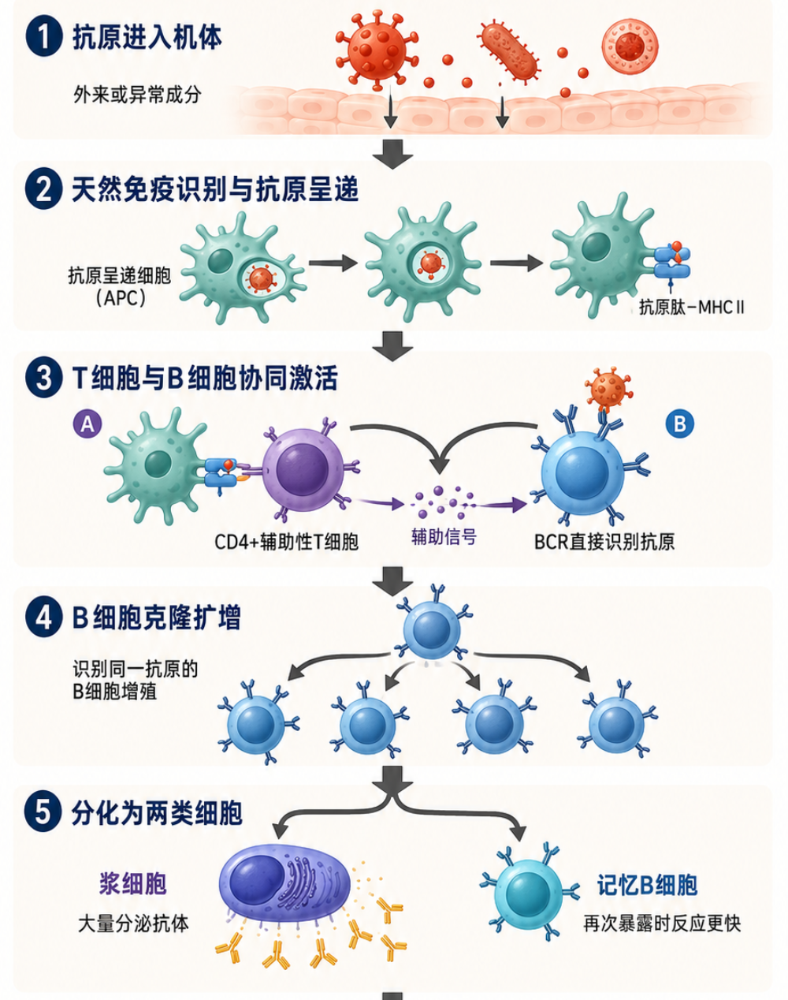

# 第 01 章：免疫系统与抗体的产生

本章是抗体药物研发知识库的起点，回答"抗体从哪里来"这一根本问题。它将帮助读者区分天然免疫和获得性免疫的基本职责，解释 B 细胞、浆细胞和记忆 B 细胞之间的关系，并理解 V(D)J 重排、体细胞高频突变和类别转换如何产生抗体多样性。不要求免疫学基础，读者只需知道细胞、蛋白质、DNA 和氨基酸序列的基本概念。

## 概念图或研发流程位置

本章是抗体药物研发全生命周期（5 个 Part）的起点，位于 Part 01"抗体基础"的第一章。它回答的是"抗体从哪里来"这一根本问题。

在研发流程中，本章内容对应的是**药物发现之前的生物学基础**——理解免疫系统如何天然产生抗体，是后续所有抗体发现、工程和 AI 建模的前提。如果用一个简化的层级图来表达：

1. **最外层**：天然免疫与获得性免疫的分工
2. **获得性免疫内部**：体液免疫（抗体）与细胞免疫（T 细胞）的协作
3. **抗体产生的细胞层面**：B 细胞 → 浆细胞 / 记忆 B 细胞
4. **抗体多样性的分子基础**：V(D)J 重排 → 连接区变化 → 体细胞突变 → 类别转换
5. **实验室的衔接**：天然 B 细胞过程 → 抗体发现技术 → 文库构建 → 亲和力成熟

> 后续章节将依次向外展开：第 02 章讨论抗体的结构与功能，第 03-05 章讨论如何发现和评价抗体，第 06-08 章讨论如何工程化优化抗体。

## 核心结论

- 抗体属于获得性免疫中的体液免疫效应分子，不是感染后最早出现的防线。
- 抗体多样性主要来自基因片段组合、连接区变化、重轻链配对和后续突变，而不是为每种抗体准备一个独立基因。
- 天然亲和力成熟发生在 B 细胞选择过程中；实验室亲和力成熟借鉴"突变-选择-扩增"逻辑，但并不完整复制免疫系统。

## 最近更新时间

2026-08-19

---

## 1. 免疫系统概览

抗体不是一个脱离生物系统存在的"结合蛋白"。它原本是获得性免疫的一部分，负责识别特定抗原，并通过中和、调理作用、补体和免疫细胞等机制帮助机体清除目标。如果不了解抗体在免疫系统中的位置，计算研究很容易把问题缩小成"预测两个分子能否结合"，却忽略结合发生在哪里、是否产生预期功能、是否招募下游效应，以及为什么完整 IgG 和抗原结合片段会有不同结果。

可以把免疫防御粗略理解为两类协同系统：

- **天然免疫（innate immunity）**：反应快，依赖相对通用的危险识别和效应机制。物理屏障、吞噬细胞、自然杀伤细胞（natural killer cell, NK cell）和补体等都属于这一层。
- **获得性免疫（adaptive immunity）**：启动较慢，但能形成高度特异的识别和免疫记忆。B 细胞和 T 细胞是核心参与者，抗体是 B 细胞分化后的重要产物。

感染发生后，天然免疫通常先控制局面并传递危险信号；随后，特异性 B/T 细胞克隆被选择和扩增。这个过程需要时间，所以初次免疫应答中的高水平抗体不会在感染瞬间出现。

### 1.1 抗体在免疫系统中的位置

抗体属于体液免疫（humoral immunity）的重要效应分子。它可以在血液、组织液或黏膜环境中识别抗原。抗体的作用不止一种：

1. **中和（neutralization）**：阻止病毒、毒素或配体与其受体发生关键相互作用。
2. **调理作用（opsonization）**：给目标加上能够被吞噬细胞识别的标记。
3. **招募效应细胞**：通过 Fc 区与 Fc 受体（Fc receptor, FcR）结合，引导免疫细胞参与清除。
4. **激活补体（complement activation）**：某些抗体形式可以启动补体级联反应。
5. **改变受体信号**：治疗性抗体可以阻断、激动或诱导受体聚集与内吞。

这些机制说明，"抗体能结合靶点"只是起点。药物研发还要确认它是否在正确位置、正确分子形式和正确细胞背景下产生预期效应。

### 1.2 抗原-抗体-免疫细胞的基本流程

一个教学化的流程：

1. 外来或异常成分进入机体，被天然免疫细胞识别和处理。
2. 抗原信息被呈递给 T 细胞和 B 细胞。
3. 能够识别该抗原的 B 细胞克隆得到激活。
4. 一部分 B 细胞分化为浆细胞（plasma cell），大量分泌抗体。
5. 一部分形成记忆 B 细胞（memory B cell），为再次暴露提供更快反应。
6. 抗体结合目标后，通过中和或 Fc 相关机制发挥作用。

真实免疫反应包含更多细胞亚群、组织结构和调控环节。本页只建立后续理解抗体产生和功能所需的最小框架。

免疫学背景会决定问题如何形式化：只给抗体序列，模型能学到的是序列统计与结构约束，未必知道特定抗原；给抗体-抗原复合物结构，模型更接近界面问题，但仍不等于细胞功能；给细胞实验标签，结果会同时受到表达量、价数、受体密度和信号网络影响；给体内药效标签，问题还包含暴露、组织分布和免疫效应等多层因素。因此，数据越接近下游研发终点，通常包含的混杂因素也越多，模型任务必须说明它处在哪个生物层级。

容易混淆的概念：

- **抗原（antigen）不等于病原体（pathogen）**：抗原是能够被免疫识别的分子或分子片段；治疗靶点也可以是人体自身蛋白。
- **结合（binding）不等于中和（neutralization）**：抗体可能结合目标，却不影响关键功能。
- **免疫原性（immunogenicity）不等于免疫效应（immune effector function）**：免疫原性讨论药物是否诱导针对自身的免疫反应；效应功能讨论抗体如何通过 Fc 等机制作用于目标。

抗体是获得性免疫中的特异性效应分子。它的药物价值由抗原识别、分子形式、下游效应、暴露和安全性共同决定。计算任务只有被放入这个层级结构中，模型输出才有明确含义。

---

## 2. B 细胞与抗体产生

许多抗体发现技术都在利用 B 细胞天然完成的工作：生成多样序列、选择能够识别抗原的克隆、在刺激后扩增，并通过突变和选择改善结合。单 B 细胞测序、免疫动物、抗体库分析和亲和力成熟都需要这层背景。

每个成熟 B 细胞表面都携带 B 细胞受体（B-cell receptor, BCR）。BCR 的抗原识别部分与该细胞未来可能分泌的抗体相对应。不同 B 细胞表达不同 BCR，整体组成一个规模庞大的天然候选库。当某个 B 细胞的 BCR 能够识别抗原，并同时获得适当的共刺激和 T 细胞帮助时，该克隆会扩增并进一步分化。可以把它理解成一个受生物学约束的"生成-筛选-扩增"系统。

### 2.1 B 细胞的发育与成熟

B 细胞来源于造血干细胞（hematopoietic stem cell），在骨髓中经历发育和受体组装。重链和轻链基因片段按一定规则重排，形成每个细胞特有的 BCR 序列。无法形成可用受体，或强烈识别自身成分的细胞，通常会在发育和耐受检查中被淘汰、失活或修正。

成熟 B 细胞离开骨髓后进入外周淋巴组织。遇到相应抗原并获得激活信号后，它们可以进入不同分化路径。

### 2.2 浆细胞与记忆 B 细胞

激活后的 B 细胞可以形成两类与抗体反应直接相关的细胞：

- **浆细胞（plasma cell）**：专门大量分泌抗体，是体液中抗体的重要来源。每个浆细胞每秒可分泌数千个抗体分子。
- **记忆 B 细胞（memory B cell）**：长期保留，再次遇到相同或相关抗原时能够更快响应。

这两个方向对应了免疫系统的两个需求：当前清除与未来记忆。

### 2.3 生发中心与天然亲和力成熟

在适当的免疫应答中，一部分 B 细胞进入生发中心（germinal center）。这里会发生：

1. 可变区的体细胞高频突变（somatic hypermutation, SHM）；
2. 不同克隆对抗原和帮助信号的竞争；
3. 结合和生存表现更合适的克隆被保留与扩增；
4. 抗体类别可以从 IgM/IgD 转换为 IgG、IgA 或 IgE 等形式。

天然亲和力成熟并不是单纯最大化某个 KD 值。细胞能否捕获抗原、处理和呈递抗原、获得 T 细胞帮助并在组织环境中存活，都会影响克隆命运。

### 2.4 天然过程与实验室工程的差别

实验室亲和力成熟借用了"突变-选择-扩增"的逻辑，但通常具有更明确、也更简化的目标，例如降低 KD、降低 koff、提高细胞活性或改善特异性。实验可以使用噬菌体、酵母或哺乳动物细胞展示，也可以直接表达纯化候选。

二者不能完全等同：

| 维度 | 天然 B 细胞过程 | 实验室工程 |
|---|---|---|
| 选择环境 | 生发中心和完整免疫系统 | 人工抗原、展示或检测体系 |
| 目标 | 生存、抗原捕获和免疫适应 | 项目定义的结合、功能与开发属性 |
| 分子形式 | 膜上 BCR 与分泌抗体 | Fab、scFv、IgG 或其他工程格式 |
| 验证 | 体内克隆选择 | 体外实验与后续体内验证 |

B 细胞来源数据并不是均匀采样的"所有可能抗体"。它们已经经历基因重排、表达、折叠、耐受、抗原选择和克隆扩增等多重过滤。模型从天然抗体库中学到的序列规律包含这些选择的结果，但不自动等同于某个特定抗原的亲和力规律。

容易混淆的概念：

- **BCR 与分泌抗体**：识别区域相关，但膜锚定形式和分泌形式的上下文不同。
- **类别转换与抗原特异性改变**：类别转换主要改变恒定区和效应功能，不是重新定义原有可变区的识别对象。
- **克隆扩增与亲和力提升**：克隆数量增加不必然证明亲和力改善，还要结合突变谱和功能数据。

B 细胞用组合重排产生初始多样性，再通过抗原驱动的克隆选择、体细胞高频突变和类别转换形成成熟抗体反应。天然抗体数据是多层生物选择后的结果，使用时必须理解它的采样偏倚。

---

## 3. V(D)J 重排与抗体多样性

抗体序列空间极其庞大，但不是任意字符串空间。它受到胚系基因片段、重排机制、结构折叠、免疫选择和物种背景的共同约束。抗体语言模型、抗体库分析和生成式设计都在直接或间接学习这些约束。

人体不会为每一种可能的抗体准备一个完整基因。B 细胞通过重组一组可复用的基因片段，为每个细胞拼出不同的可变区。重链可变区主要由 V（variable）、D（diversity）和 J（joining）片段组合；轻链可变区主要由 V 和 J 片段组合。不同片段的选择、连接处的删除与插入、以及重链和轻链的配对共同产生巨大多样性。

### 3.1 多样性的五大来源

**组合多样性（combinatorial diversity）**：从多个 V、D、J 片段中各选一个进行组合。人类重链基因座约有 40-50 个功能性 V 片段、约 25 个 D 片段和 6 个 J 片段；轻链也有各自的 V 和 J 片段库。不同物种、不同基因座和个体的可用片段集合并不完全相同。

**连接区多样性（junctional diversity）**：片段连接不是简单的无缝拼接。连接处可以发生核苷酸删除和非模板插入（N-nucleotide addition），使同一组 V/D/J 选择产生不同序列。重链 CDR3 往往受到连接区变化的强烈影响，因此具有极高多样性，也是抗体-抗原界面的核心区域。

**重轻链配对（heavy-light chain pairing）**：同一条重链与不同轻链配对，或同一条轻链与不同重链配对，都可能改变结合界面、表达和特异性。只有单链信息时，模型会丢失真实配对上下文。这也是为什么配对测序数据（paired sequencing）在抗体发现中越来越受重视。

**体细胞高频突变（somatic hypermutation, SHM）**：抗原刺激后，活化 B 细胞可在可变区积累突变。选择过程会富集在特定免疫环境中表现更合适的克隆。突变既可能改善结合，也可能破坏表达、稳定性或原有识别模式。SHM 主要发生在 CDR 区域，但框架区也可能出现突变。

**类别转换（class switch recombination, CSR）**：类别转换改变重链恒定区，使相同或相近的抗原识别区域连接到不同效应功能。它增加的是功能形式多样性，而不是重新完成一次 V(D)J 重排。例如，初始 IgM 可以转换为 IgG、IgA 或 IgE，在不同组织环境中发挥不同作用。

### 3.2 CDR 与框架区

抗体可变区通常被划分为互补决定区（complementarity-determining region, CDR）和框架区（framework region, FR）。CDR 经常直接参与抗原结合，尤其是 CDR3；框架区则为可变域提供结构支撑，也可能通过构象或直接接触影响结合。"只修改 CDR、框架区不重要"是过度简化——人源化和亲和力成熟中，框架区突变可能影响 CDR 构象、重轻链界面和稳定性。

### 3.3 编号体系简介

同一抗体序列可以采用不同编号体系标注位置。插入位点和 CDR 边界在不同体系中可能不完全相同。数据清洗、突变定位和模型结果比较时，必须记录所用编号体系；只写"第 100 位"而不说明链、体系和参考序列，往往不可复现。

| 体系 | 特点 | 常见用途 |
|---|---|---|
| IMGT | 基于胚系基因比对，标准化程度高 | 数据库注释、免疫组库分析 |
| Kabat | 基于序列变异性，历史最悠久 | 经典文献、人源化设计 |
| Chothia | 基于结构环区位置 | 结构分析、CDR 移植 |

详细的编号规则和 CDR 定义将在第 02 章展开。

### 3.4 对模型和数据集的意义

1. **序列分布并非独立同分布**：同一克隆谱系中的序列高度相似，随机切分可能造成训练/测试泄漏。应使用按克隆谱系或供体的分组切分策略。
2. **重轻链配对很重要**：非配对测序数据不能完整表示真实抗原结合位点。配对数据是更准确的输入，但获取成本更高。
3. **胚系来源是强先验**：模型可能通过物种、基因家族（V-gene family）或克隆背景获得表面上很高的预测性能，而非真正学到了抗原结合规律。
4. **突变位置不是等价的**：CDR、框架、界面、核心区和溶剂暴露位置受到的约束不同。模型应区分不同区域的突变容忍度。

容易混淆的概念：

- **理论序列空间与生物可达空间**：氨基酸组合数量巨大，但真正能由重排产生、正确表达并通过选择的空间小得多。
- **多样性与有效多样性**：名义上不同的序列不一定都正确折叠、表达或保留功能。许多含终止密码子或错误折叠的序列会被自然淘汰。
- **体细胞突变与随机诱变**：两者都产生序列变化，但机制、偏好和选择环境不同。SHM 有特定的热点基序和酶学偏好，PCR 随机诱变则更均匀。

抗体多样性来自基因片段组合、连接区变化、重轻链配对和后续突变。它既非常庞大，又受到强烈生物约束。对计算研究而言，正确处理克隆关系、配对信息、编号体系和数据切分，与模型架构同样重要。

---

## 推荐阅读与来源

- Murphy, K., & Weaver, C. (2016). *Janeway's Immunobiology* (9th ed.). Garland Science. 第 1-5 章和第 10 章为本章提供标准免疫学框架。
- Lefranc, M.-P. (2014). Immunoglobulin and T cell receptor genes: IMGT and the birth and rise of immunoinformatics. *Frontiers in Immunology*, 5, 22. IMGT 是抗体序列编号和基因片段分类的核心数据库。
- Olsen, T. H., Boyles, F., & Deane, C. M. (2022). Observed Antibody Space: A diverse database of cleaned, annotated, and translated unpaired and paired antibody sequences. *Protein Science*, 31(1), 141-146. OAS 数据库是抗体序列分析的重要资源。